# Savor the Seasons (Seasonal Recipes Website)

Welcome to the _Savor the Seasons_ MERN stack project!

- Visit _Savor the Seasons_ front-end repository [here](https://github.com/realpolya/savor-seasons-react).

- Visit _Savor the Seasons_ back-end repository [here](https://github.com/paolasoria0597/Savor-the-Seasons-BackEnd).

**Authors:** Mandy Decamp, Paola Tatiana Soria, Polina Stepanova

## Planning Phase

### User Stories

#### As A user(AAU):

- AAU I want to be able to see a landing page showing me a list of recipes that I can click on and view details
- AAU, I want to sign up for an account and sign in, so that I can access my personal user profile and manage my recipes and create reviews.
- AAU, I should see a nav bar with links at the top of each page in the application.
- AAU, once I login I want to go to my dashboard and see the recipes
  I have created and a list of my favorite recipes along with a section to create a recipe.
- AAU, clicking on the ‘Home’ link should navigate me to a landing page where I can see other users recipes.
- AAU, I want to have the option to sign out in whichever page I'm in.
- AAU, I want to be able to use a sort bar on the landing page which Ican give me the option to filter recipes based on author, seasons, and holidays.

### Wireframe

Our wireframe was made using Figma.

#### Landing (no sign-in required)

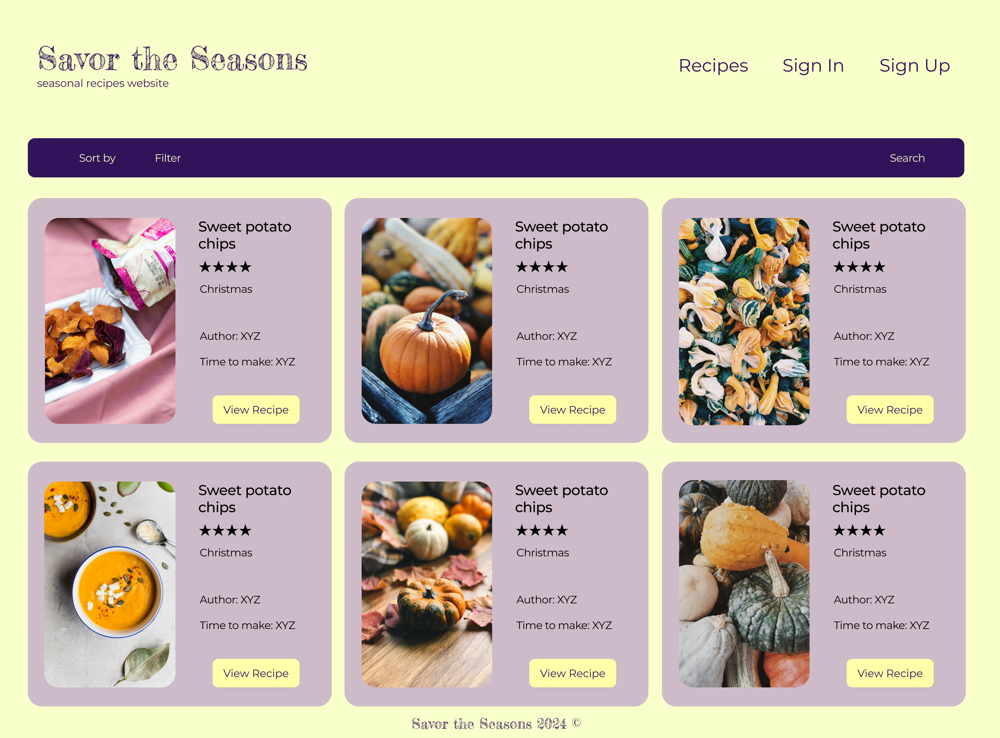

#### Dashboard

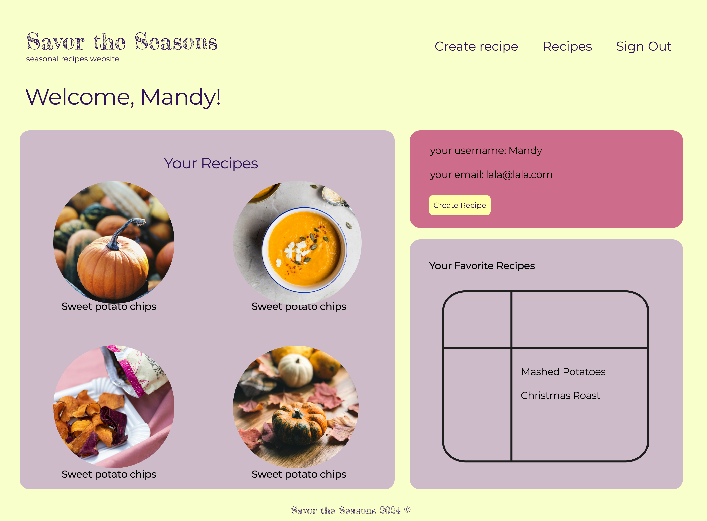

#### Recipe Page

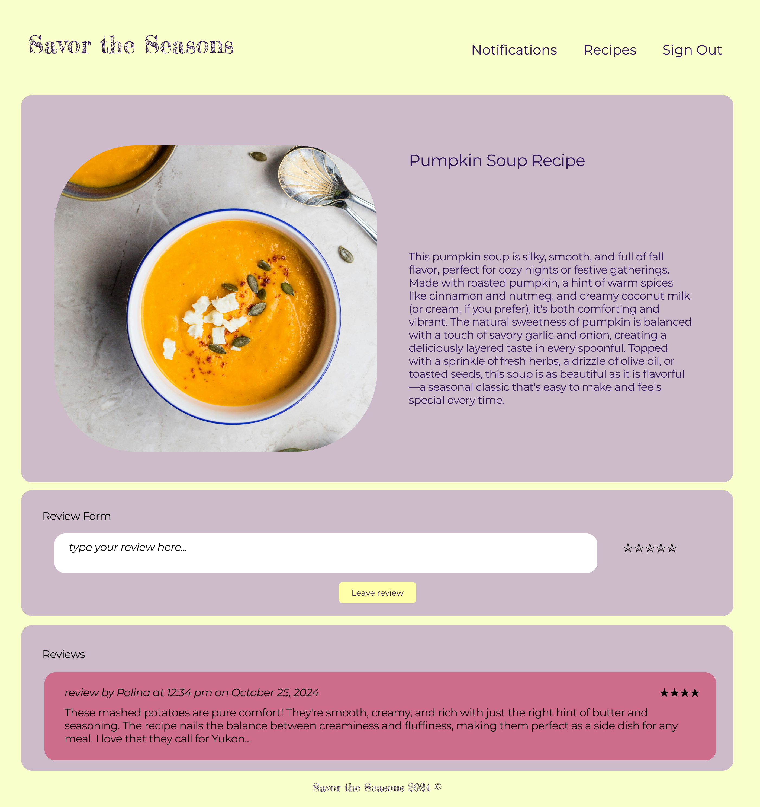

### Flow chart

Our Flow chart using Figma.
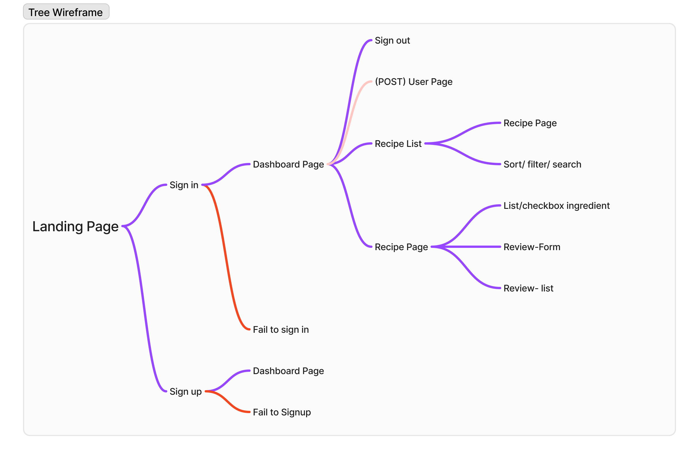

### Color Palette

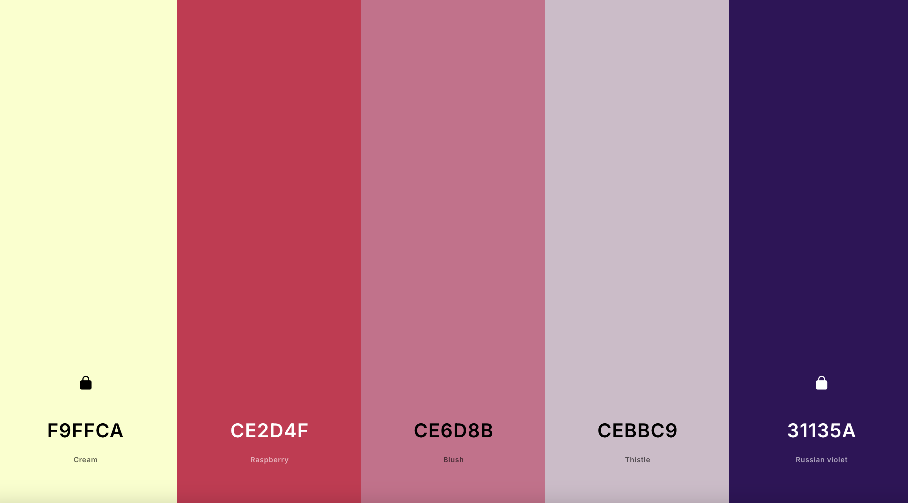

```javascript
:root {
  --dark-color: #31135A;
  --light-color: #CEBBC9;
  --background-color: #F9FFCA;
  --accent-color: #CE2D4F;
  --text-color: #31135A;
  --white-color: white;
  --light-accent-color: #CE6D8B;
  --button-color: #CE6D8B;
  --button-hover-color: #CE2D4F;
  --link-hover-color: #31135A;
  --grey-color: #585858;

  --span-color: rgb(112, 0, 69);

  --main-font: "Montserrat", sans-serif;
  --decor-font: "Fredericka the Great", sans-serif;

  /* max-width for mobile */
  --mobile-width: 820px;
}
```

### Entity Relationship Diagram (ERD)

ERD was made using Figma.

We have five models. The User, Favorite and Recipes are refrencing each other. The Ingredents are only refrenced with the Recipes. The Review is enbedded and only refrenced with User.
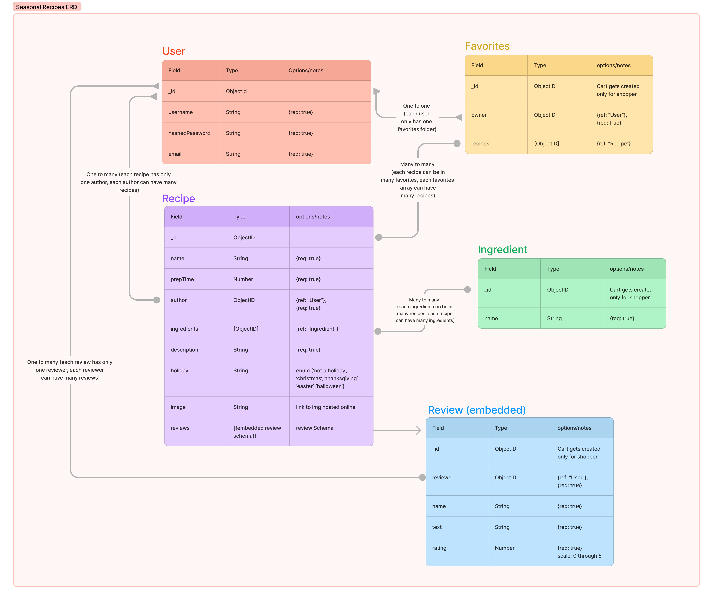

### Components

The following tree structure shows the components and their inner relationship.
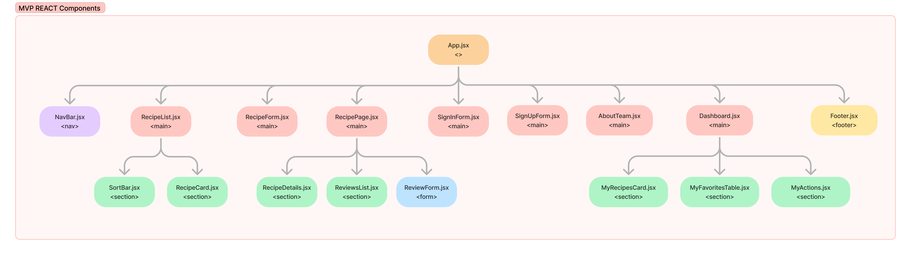

### Trello

Visit the [Trello board](https://trello.com/b/AMCXx13r/seasonal-recipes-app) for the projects layout.

### Technologies used

- Node.js
- Express
- MongoDB, Monoose
- HTML
- CSS
- JavaScript
- npm packges:

```javascript

  "dependencies": {
    "axios": "^1.7.7",
    "react": "^18.3.1",
    "react-dom": "^18.3.1",
    "react-router-dom": "^6.27.0",
    "react-simple-star-rating": "^5.1.7"
  },
  "devDependencies": {
    "@eslint/js": "^9.13.0",
    "@types/react": "^18.3.11",
    "@types/react-dom": "^18.3.1",
    "@vitejs/plugin-react": "^4.3.3",
    "eslint": "^9.13.0",
    "eslint-plugin-react": "^7.37.1",
    "eslint-plugin-react-hooks": "^5.0.0",
    "eslint-plugin-react-refresh": "^0.4.13",
    "globals": "^15.11.0",
    "vite": "^5.4.10"
  }

```

### Routes

#### User Routes

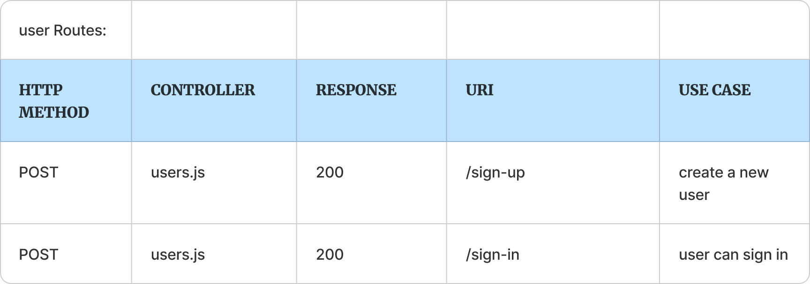

### Recipes RoutesS


#### Favorite Routes

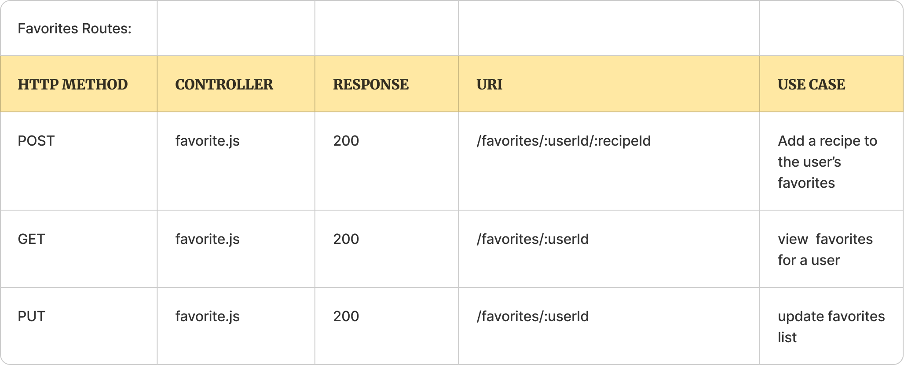

#### Ingredents Routes

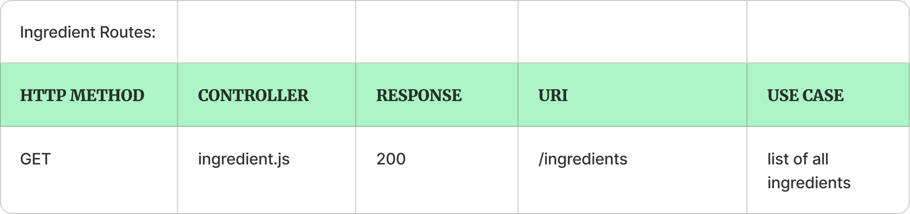

#### Review Routes

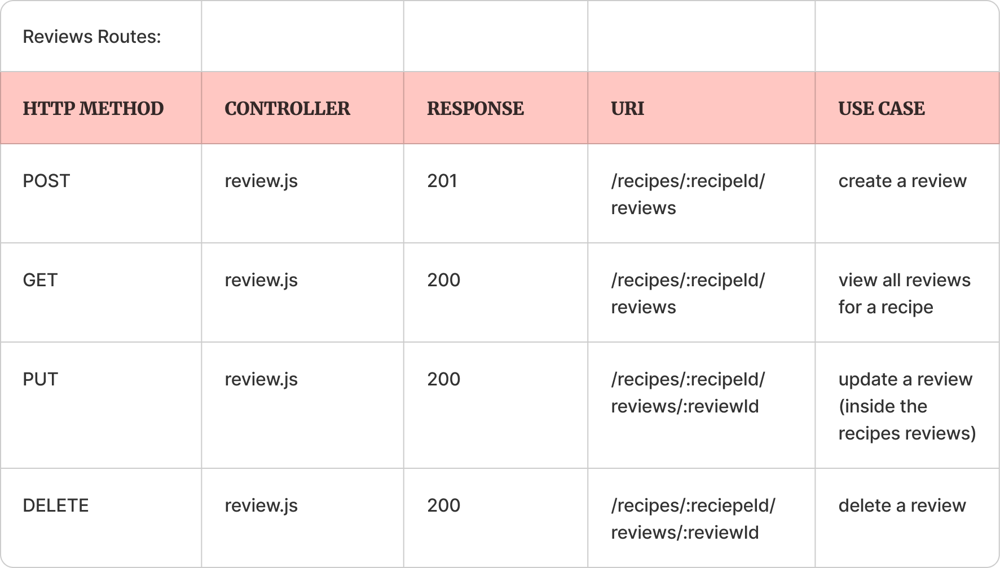

### Back-End Mongoose Models

- User model:

```javascript
export default mongoose.model(
  "User",
  new mongoose.Schema(
    {
      username: {
        type: String,
        require: true,
      },
      hashedPassword: {
        type: String,
        require: true,
      },
      email: {
        type: String,
        require: true,
      },
    },
    { timestamps: true }
  ).set("toJSON", {
    transform: (document, returned) => {
      delete returned.hashedPassword;
    },
  })
);
```

- Recipe model:

```javascript
export default mongoose.model(
  "Recipe",
  new mongoose.Schema(
    {
      name: {
        type: String,
        required: true,
      },
      prepTime: {
        type: Number,
        required: true,
      },
      author: {
        type: mongoose.Schema.Types.ObjectID,
        required: true,
        ref: "User",
      },
      ingredients: [
        {
          type: mongoose.Schema.Types.ObjectId,
          ref: "Ingredient",
        },
      ],
      description: {
        type: String,
        required: true,
      },
      holiday: {
        type: String,
        required: true,
        enum: [
          "Not a Holiday",
          "Christmas",
          "Thanksgiving",
          "Easter",
          "Halloween",
        ],
      },
      image: {
        type: String,
      },
      reviews: [reviewSchema],
    },
    { timestamps: true }
  )
);
```

- Favorites model:

```javascript
export default mongoose.model(
  "Favorites",
  new mongoose.Schema(
    {
      owner: {
        type: mongoose.Schema.Types.ObjectId,
        required: true,
        ref: "User",
      },
      recipes: {
        type: Array,
        default: [],
        ref: "Recipe",
      },
    },
    { timestamps: true }
  )
);
```

- Ingredient model:

```javascript
export default mongoose.model(
  "Ingredient",
  new mongoose.Schema(
    {
      name: {
        type: String,
      },
    },
    { timestamps: true }
  )
);
```

### Back-End Express Routes

#### Routes for /auth

| Route                 | Method | Description                                                                |
| --------------------- | ------ | -------------------------------------------------------------------------- |
| `/users/:userId/auth` | GET    | Checks if authenticated user matches userId, returns profile if authorized |
| `/auth/sign-up`       | POST   | Registers a new user and generates a token                                 |
| `/auth/sign-in`       | POST   | Authenticates user and returns a token                                     |

#### Routes for /favorites

| Route                  | Method | Description                                   |
| ---------------------- | ------ | --------------------------------------------- |
| `/favorites`           | GET    | Retrieves the user's list of favorite recipes |
| `/favorites/:recipeId` | POST   | Adds a recipe to the user's favorites         |
| `/favorites/:recipeId` | PUT    | Removes a recipe from the user's favorites    |

#### Routes for /ingredients

| Route          | Method | Description                           |
| -------------- | ------ | ------------------------------------- |
| `/ingredients` | GET    | Returns all ingredients to the client |

#### Routes for /recipes

| Route                                 | Method | Description                                                                       |
| ------------------------------------- | ------ | --------------------------------------------------------------------------------- |
| `/recipes`                            | GET    | Retrieves all recipes, including author, ingredients, and reviews                 |
| `/recipes/:recipeId`                  | GET    | Retrieves a single recipe by recipeId, including author, ingredients, and reviews |
| `/recipes/user`                       | GET    | Retrieves recipes created by the authenticated user                               |
| `/recipes`                            | POST   | Creates a new recipe for the authenticated user                                   |
| `/recipes/:recipeId`                  | PUT    | Updates a recipe by recipeId for the authenticated user                           |
| `/recipes/:recipeId`                  | DELETE | Deletes a recipe by recipeId for the authenticated user                           |
| `/recipes/:recipeId/review`           | POST   | Adds a review to a recipe                                                         |
| `/recipes/:recipeId/review/:reviewId` | PUT    | Updates a specific review by reviewId for a recipe                                |
| `/recipes/:recipeId/review/:reviewId` | DELETE | Deletes a specific review by reviewId from a recipe                               |

### Post-MVP goals

- Create auto-complete input bar for ingredients instead of check-box. The ingredients database would serve as an API library fetching suggestions for the user as they type.
- Create POST route for ingredients. User would be able to type their own ingredient, and it would automatically expand the database of ingredients.
- Create a recipe social media platform where users can follow other users and get notifications when their favorite chefs post new recipes.
- Work on CSS for mobile and add a "hamburger" bar functionality.
- Create an email authentication check.

### Sources

- Unsplash (stock photo)
- chatGPT
