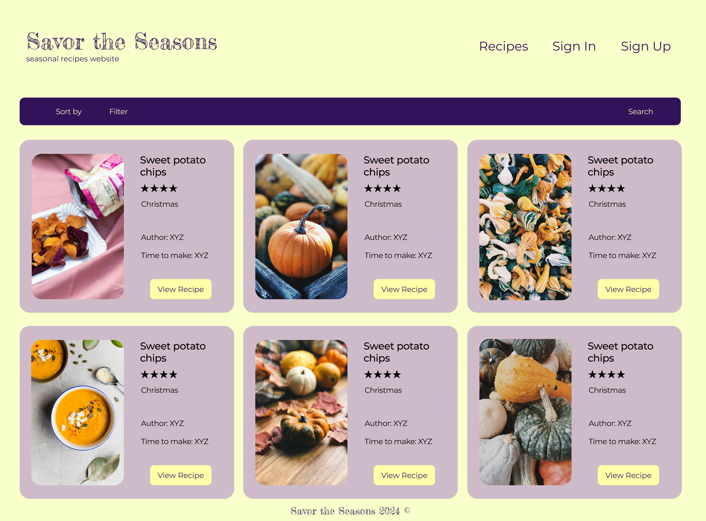
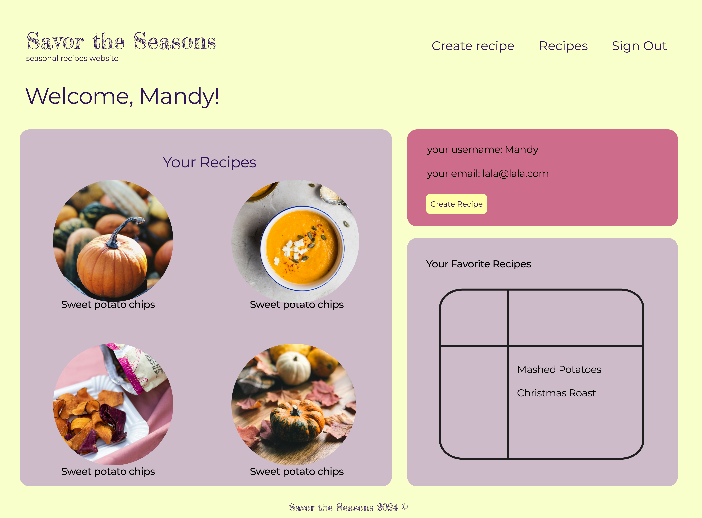
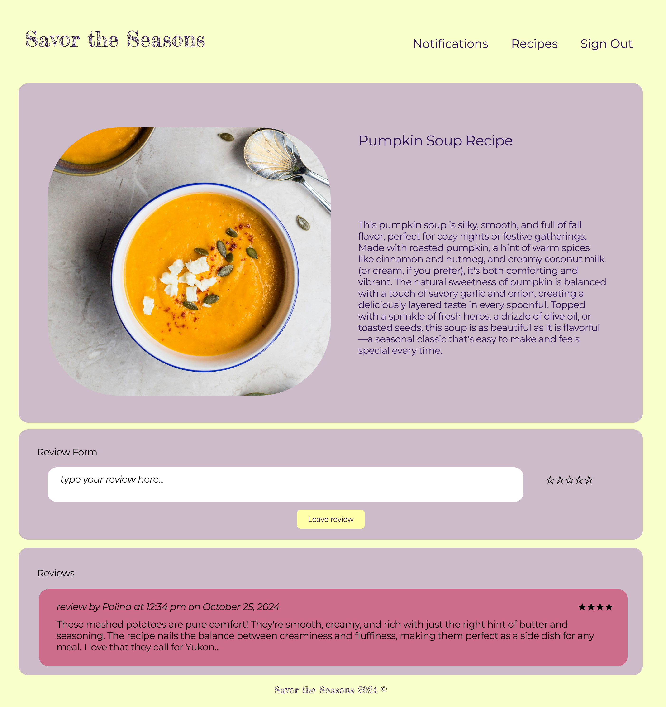
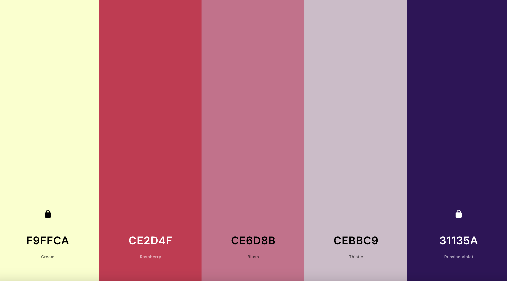
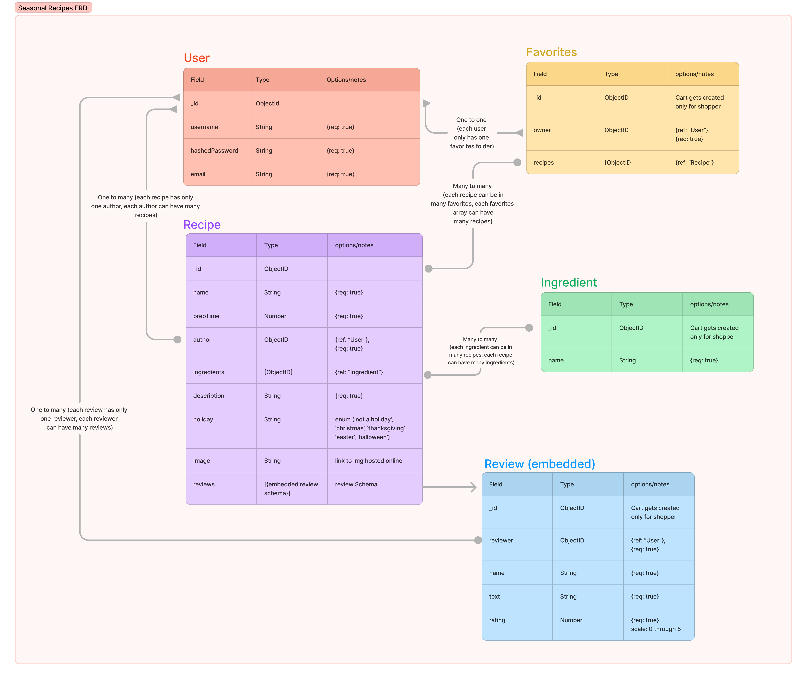
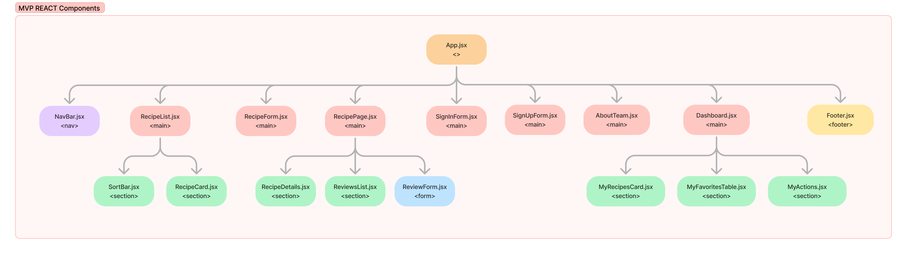

# Savor the Seasons (Seasonal Recipes Website)

This repo holds the front-end for the Savor the Seasons projects.

Authors: Mandy Decamp, Paola Tatiana Soria, Polina Stepanova

## Planning Phase

### User Stories

#### As A user(AAU):

- AAU I want to be able to see a landing page showing me a list of recipes that I can click on and view details
- AAU, I want to sign up for an account and sign in, so that I can access my personal user profile and manage my recipes and create reviews.
- AAU, I should see a nav bar with links at the top of each page in the application.
- AAU, once I login I want to go to my dashboard and see the recipes
  I have created and a list of my favorite recipes along with a section to create a recipe.
- AAU, clicking on the ‘Home’ link should navigate me to a landing page where I can see other users recipes.
- AAU, I want to have the option to sign out in whichever page I'm in.
- AAU, I want to be able to use a sort bar on the landing page which Ican give me the option to filter recipes based on author, seasons, and holidays.

### Wireframe

Our wireframe was made using Figma.

#### Landing (no sign-in required)



#### Dashboard



#### Recipe Page



### Flow chart

Our Flow chart using Figma.


### Color Palettes



```javascript
:root {
    --main-color: #FFDECF;
    --accent-color: #E79069;
    --dark-color: #A36B61;
    --red-color: #C4515B;
    --darkred-color: darkred;
    --light-color: #FFECE6;
    --text-accent-color: darkred;
    --button-color: #FFF5EA;
    --halloween-orange: #FFE6BB;
    --halloween-orange-font: orange;
    --halloween-main-color: #9583B1;
    --halloween-dark-color: #624090;
    --halloween-text-accent-color: #624090;
}
```

### Entity Relationship Diagram (ERD)

ERD was made using Figma.

We have five models. The User, Favorite and Recipes are refrencing each other. The Ingredents are only refrenced with the Recipes. The Review is enbedded and only refrenced with User.


### Components

We used a image to map our flies and worked through our components.


### Trello

Visit the [Trello board](https://trello.com/b/AMCXx13r/seasonal-recipes-app) for the projects layout.

### Technologies used

- Node.js
- Express
- MongoDB, Monoose
- HTML
- CSS
- JavaScript
- npm packges:

```javascript

  "dependencies": {
    "axios": "^1.7.7",
    "react": "^18.3.1",
    "react-dom": "^18.3.1",
    "react-router-dom": "^6.27.0",
    "react-simple-star-rating": "^5.1.7"
  },
  "devDependencies": {
    "@eslint/js": "^9.13.0",
    "@types/react": "^18.3.11",
    "@types/react-dom": "^18.3.1",
    "@vitejs/plugin-react": "^4.3.3",
    "eslint": "^9.13.0",
    "eslint-plugin-react": "^7.37.1",
    "eslint-plugin-react-hooks": "^5.0.0",
    "eslint-plugin-react-refresh": "^0.4.13",
    "globals": "^15.11.0",
    "vite": "^5.4.10"
  }

```

### Routes

### User Routes


### Recipes RoutesS


### Favorite Routes


### Ingredents Routes


### Review Routes


### JS Models Files

-

### Sources

- Unsplash (stock photo)
- chatGPT
